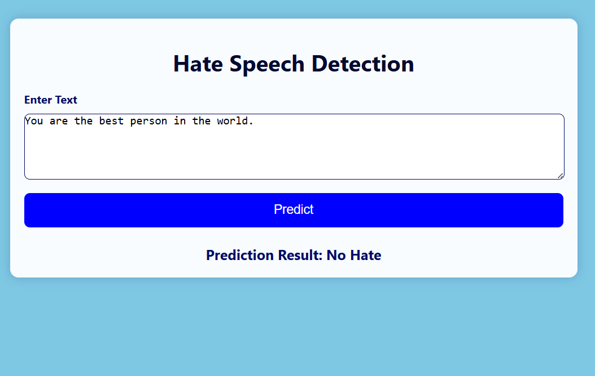

# 🛡️ Hateful Text Detector

A web-based machine learning application built using **Flask** and **TensorFlow** to detect whether a given piece of text contains hate speech or not.

## 🚀 Demo
Try entering a sentence like:
 <!-- Add your own screenshot here -->

---

## 🛠️ Technologies Used

- **Python**
- **Flask** (Web Framework)
- **TensorFlow/Keras** (Model Prediction)
- **Pandas** (Data Handling)
- **HTML/CSS** (UI/Styling)

---

## Order to run the Project
```shell
$ python -m pip install .
$ python data_ingestion.py
$ python app.py
```
## View the app here
http://127.0.0.1:5050